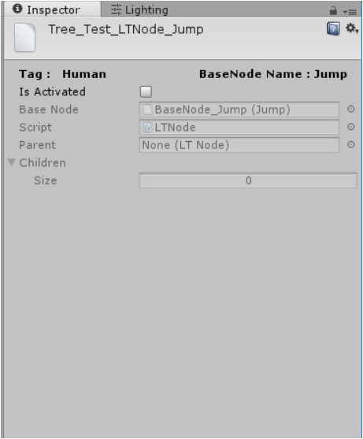

SkillLearningTree && LTNode
=============================================

``SkillLearningTree`` is a tree that describes the parent-child relation
between ``SkillNodes``.It can only be generated from a ``SkillNodeLib``
in the ``NodeLibEditor``\ (*Window-> Skill Lib*).

A ``SkillLearningTree`` can be visualized in the
``TreeEditor``\ (*Window->Skill Tree*).

The basic unit of ``SkillLearningTree`` is
``LTNode``\ (i.e. LearningTree Node).

s\ |1517627410420|

Based on\ ``SkillNode``,\ ``LTNode`` has parent/child nodes and
``activate/nonactivate`` property to descripe wheather a skill has been
acquired.

A\ ``LTNode`` can be ``Activated`` only when all of its child nodes are
``Activated``.

.. figure:: ./images/ 1517628437759.png
   :alt: 1517628437759

   

When a tree is generated, it copys all the nodes from the library and
saves them as subassets which prevents the data inconsistence over the
library when modifying multiple trees from the same library.

The tree will then create LTNodes based on these SkillNodes.

From now on, if you want to modify anything over this tree,you shall not
go to the library but only working on your tree asset.

Description: LearningTreeEditor
~~~~~~~~~~~~~~~~~~~~~~~~~~~~~~~

Now Let’s talk about the Tree Editor ``Skill Tree``.

It has following features:

-  ``Control+ middle mouse`` to scale the graph.
-  ``middle mouse drag`` to move the graph.
-  click ``Hierachy Drag`` to drag a subtree rather than one single
   node.
-  ``right click`` on a node to establish parent-child relation.
-  ``control+ right click`` to break parent- child relations( idea from
   *Shaderforge*)
-  Press ``details`` to fold out/ in the node window.(It could be more
   cleaner and tighter).

.. figure:: ./images/ U1XOXG831NF990X1@93E1.png
   :alt: U1XOXG831NF990X1@93E1

   

.. figure:: ./images/ 1517890926417.png
   :alt: 1517890926417

   

Notice that one ``SkillLearningTree`` can only be uniquely assigned for
one skill system(*The Skill*).

If requiring multiple systems to use the same tree, you should make
copies of tree and assign to the systems respectively.

