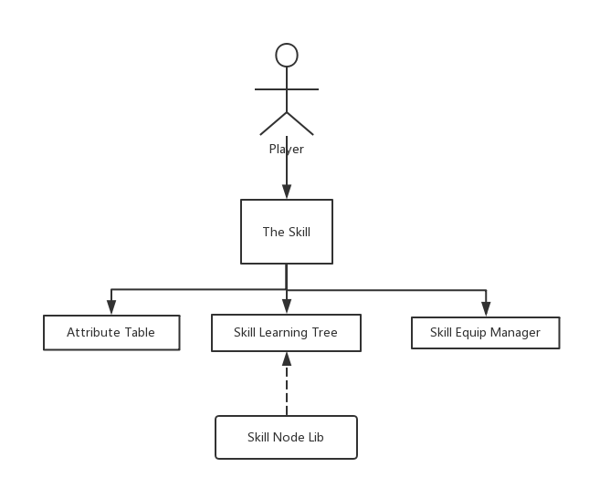

Structure of *The Skill*
=========================

*The Skill* consists of four main parts,
``AttributeTable``,\ ``SkillNodeLib``,\ ``SkillLearningTree``\ (In
brief, SkillTree) and ``SkillEquipManager``.

   Structure

``TheSkill`` is the overall system and inherits from ``MonoBehaviour``
as ``SkillEquipManager``.

``AttributeTable`` ,\ ``SkillNodeLib``\ and ``SkillLearningTree``
inherit from ``ScriptableObject``\ which means they are data that can be
modified and saved in edit mode.

When comes to runtime usage, ``SkillNodeLib`` is not required at all as 
long as you have attached a ``SkillLearningTree`` to the system
``TheSkill``\ (Though the tree can only be generated from a
``SkillNodeLib``).

Besides,you should also attach an ``AttributeTable`` to give a property reference for all your ``SkillNodes``.

Do not worry about ``SkillEquipManager``, it will be **AutoGenerated** when comeing to play mode.You are not required to create a manager by yourself.